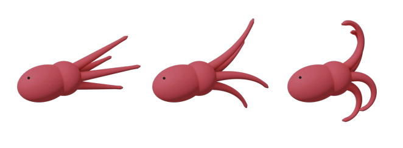
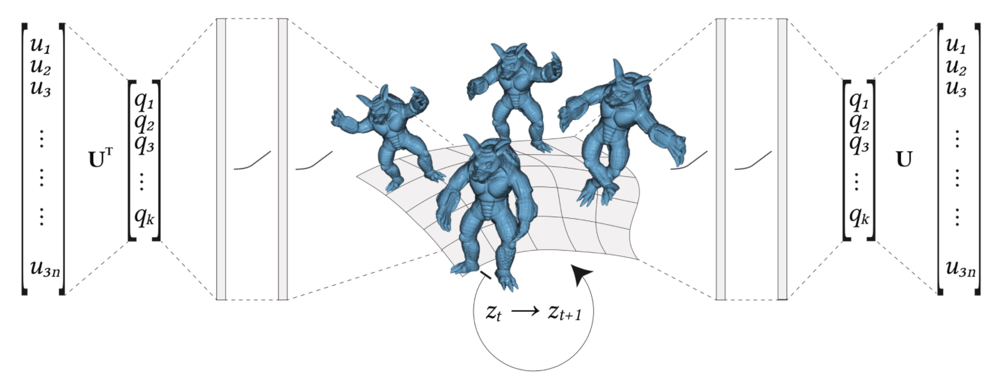
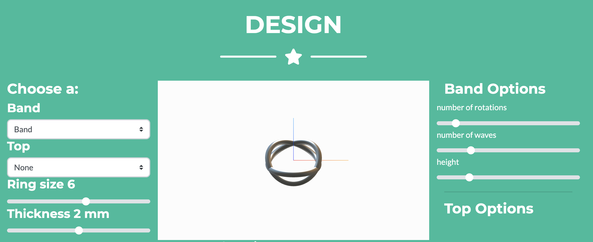

<h1 class="about__title">Research Papers</h1>

	
	
		<strong style="font-weight:bold">EMU: Efficient Musculoskeletal Simulations in Deformation Space</strong>  
		Vismay Modi, Lawson Fulton, Shin Sueda, Alec Jacobson, David I. W. Levin
		 
		<em style="font-style: italic;">Computer Graphics Forum 2020</em>  
		<a href="https://arxiv.org/abs/2006.08821">Paper</a> | <a href="https://www.dgp.toronto.edu/projects/efficient-muscles/">Project Page</a>
	

 

	
	
		<strong style="font-weight:bold">Autodef: Latent-space Dynamics for Reduced Deformable Simulation</strong>  
		Lawson Fulton, Vismay Modi, David Duvenaud, David I. W. Levin, Alec Jacobson
		 
		<em style="font-style: italic;">Eurographics 2019</em>  
		<a href="http://www.dgp.toronto.edu/projects/latent-space-dynamics/latent-space-dynamics-for-reduced-deformable-simulation-eurographics-2019-fulton-et-al.pdf">Paper</a> | <a href="https://www.dgp.toronto.edu/projects/latent-space-dynamics/">Project Page</a>
	

<!-- 

	<a href="https://www.dgp.toronto.edu/projects/latent-space-dynamics/">Autodef:  Latent-space Dynamics for Reduced Deformable Simulation </a>

 -->

<h1 class="about__title">Fun Projects</h1>

	
	
		<strong style="font-weight:bold">Designeering</strong>  
		<a href="https://www.designeering.studio">Project Page</a>
	

